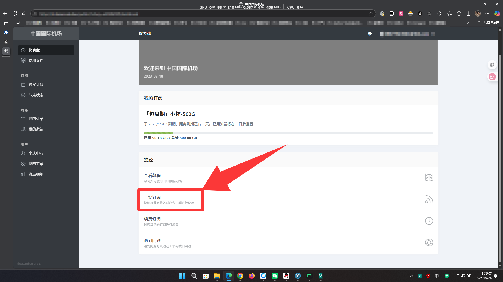
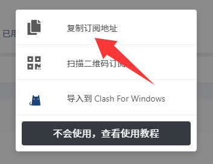
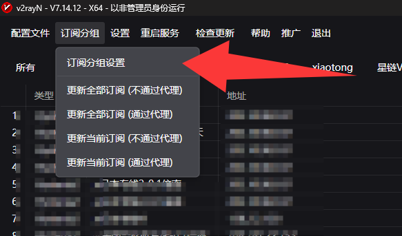
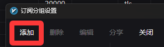
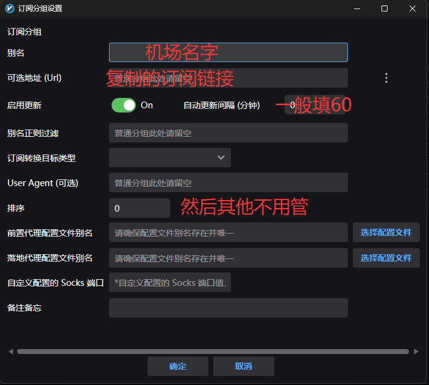
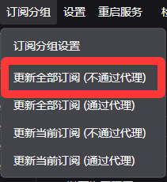
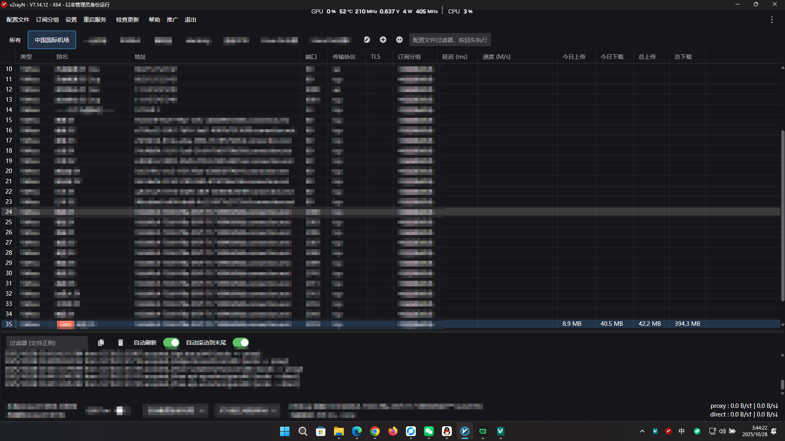
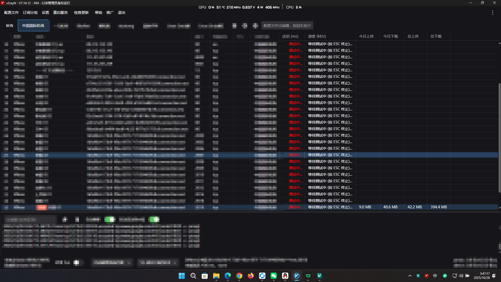
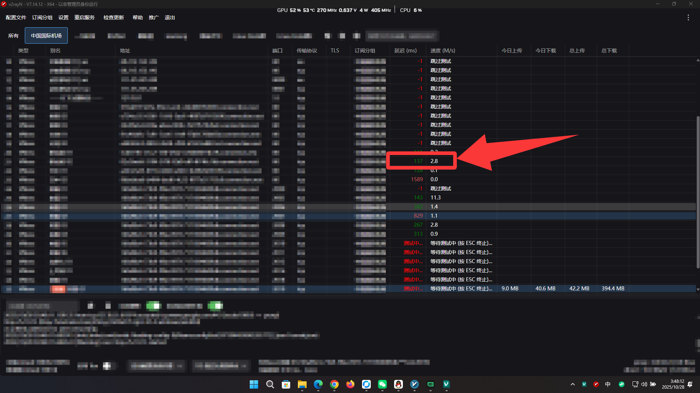
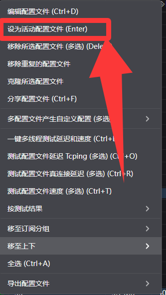

# 机场配置教程：从订阅到使用的完整指南

<!-- 简要描述文章内容，1-2句话概括 -->
本教程将指导你如何将机场订阅配置到V2RayN客户端，并正确使用节点服务。

## 📋 前置要求

<!-- 列出读者需要具备的基础知识或准备工作 -->
在开始学习本文内容之前，你需要：

- ✅ 已购买机场订阅服务
- ✅ 已安装V2RayN客户端
- ✅ 准备好灵活的操作和清晰的思路

## 🎯 学习目标

<!-- 明确说明读者完成本文学习后将获得的技能或知识 -->
完成本教程后，你将能够：

- ✅ 正确配置机场订阅
- ✅ 正确更新订阅信息
- ✅ 正确选择和使用节点

## 第一部分：正确配置机场

### 步骤1：获取订阅链接

**第一步：点击一键订阅**

确保你已购买机场服务，然后在机场网站找到订阅按钮。

### 步骤2：导入节点到V2RayN

**从机场复制订阅地址**

在机场页面找到"复制订阅地址"按钮并点击复制。

**打开V2RayN订阅设置**

在V2RayN客户端中找到"订阅分组"选项，点击"订阅分组设置"。

**添加新的订阅**

点击"添加"按钮创建新的订阅分组。

**填写订阅信息**

按照图示内容填写订阅信息，包括订阅地址和备注名称。

## 第二部分：正确更新订阅

**更新订阅内容**

填写保存后，点击"更新全部订阅（不通过代理）"来获取最新节点列表。

**查看节点列表**

更新成功后，你将看到完整的节点列表显示在客户端中。

## 第三部分：正确使用节点

**测速节点性能**

使用快捷键 `Ctrl + E` 开始对所有节点进行测速。

**选择优质节点**

测速完成后，找到一个延迟低、速度快的节点。

**设置为活动节点**

右键点击选中的节点，选择"设为活动配置文件"来启用该节点。

## 🎉 恭喜完成！

你已经成功完成机场配置、节点更新和使用的全部流程。现在可以畅享网络服务了！
